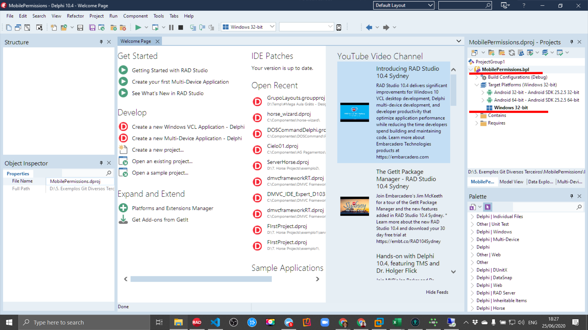

<p align="center">
  <a href="./image/logo.fw.png">
    
  </a>
</p>

# MobilePermissions
This is a component to turn more easy the request permission in Android 8.x or later.

The MobilePermissions component was developed to facilitate the request and granting of permission to the operating system resources that the application needs to use. We seek to make the life of the Delphi Mobile developer simpler.

We translate all the permissions provided for in <i>Project > Options > Application > User Permissions</i> to the component, so the developer will not need to enter the project settings window to mark the permissions he wants to request, just drag a MobilePermissions component to the Form and mark the properties What do you want.

## 💎 Categories
The component was divided into 03 (three) distinct categories of permissions represented by properties and sub-properties. Are they:

<ul>
  <li><b>DANGEROUS</b>: The following uses permissions require runtime user approval. </li>
  <li><b>SIGNATURE</b>: The following uses permissions require a matching certificate. </li>
  <li><b>STANDARD</b>: Normal Uses Permissions</li>
</ul>

## 😎 Facilities
When using the component, the developer is no longer required to access <i>Project > Options > Application > User Permissiosn</i> because when checking/unchecking the property, the component automatically adjusts the project settings.


## Before Installed
Make sure you have uninstalled any previous versions of the component before installing a new one.

## Installation by Package

1. Open Delphi in <b>Administrator mode</b>. Delphi needs build and create a .BPL in System Directories.
2. Open MobilePermissions package file <b>MobilePermissions.dpk.</b>
3. Right click in MobilePermissions.bpl in Project Manager and select <b>Clean.</b>
4. Right click in MobilePermissions.bpl in Project Manager and select <b>Build.</b>
5. Right click in MobilePermissions.bpl in Project Manager and select <b>Install.</b>

> If the Install menu does not showing in context menu then select Windows 32-bit in Project Manager and click right button again.



Ready! 😎

## Installation by Get It Package Manager?
1. Open Delphi in <b>Administrator mode</b>. Delphi needs build and create a .BPL in System Directories.
2. Open <i>Tools > Get It Packager Manager.</i>
3. Type <i>MobilePermissions</i> in the search box.
4. When you find the component click over it his and click in <b>Install Button.</b>


5. Accept terms and contract clicking in Agree all and Next
6. Wait the installion process

Ready! 😎

##  ⚡️ Quickstart
###### Mode 1
1. Drop a component to form (Tool Palette TDevRocks).
2. Select the permission that you want to request to Android in your project mobile.
3. Run your app in Android.

###### Mode 2
1. Create a new project.
2. Drag controls like below.
<ul>
  <li>Drag a TButtom onto form</li>
  <li>Drag a TMobilePermissions onto form</li>
  <li>In the OnCreate event of the Form type</li>
</ul>

3. Type code.
```delphi
procedure TForm1.OnCreate(Sender: TObject);
begin
  MobilePermissions1.[CATEGORY].[Permission] := True;
  MobilePermissions1.Apply;
end;
```

E.g.:

```delphi
procedure TForm1.Button1Click(Sender: TObject);
begin
  MobilePermissions1.Dangerous.CAMERA := True;
  MobilePermissions1.Standard.AccessNetworkState := True;
  MobilePermissions1.Apply;
end;
```

3. Run your app in Android.

## ⚠ Requirements
Add this folders path into <b>Search Path</b> field like bellow:<br>

```
\MobilePermissions\source<br>
\MobilePermissions\component<br><br>
```

Recompile and redistrbuilt your project and e voilà<br>

## 🧪 Tests performed on
Android 7.0 (This version dosen't need this component, but can you use without problem)<br>
Android 8.x<br>
Android 9.x<br>
Android 10<br>
Android 11<br>
Android 12<br>

## Documentation Languages
[English (en)](https://github.com/adrianosantostreina/MobilePermissions/blob/master/README.md)<br>
[Português (ptBR)](https://github.com/adrianosantostreina/MobilePermissions/blob/master/README.ptBR.md)<br>

## ⚠️ License
`MobilePermissions` is free and open-source library licensed under the [MIT License](./LICENSE.md). 